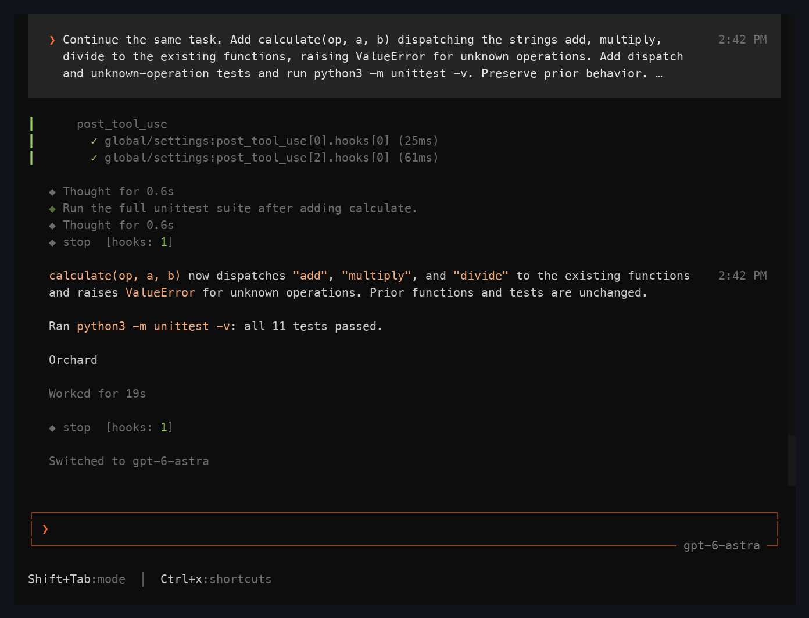
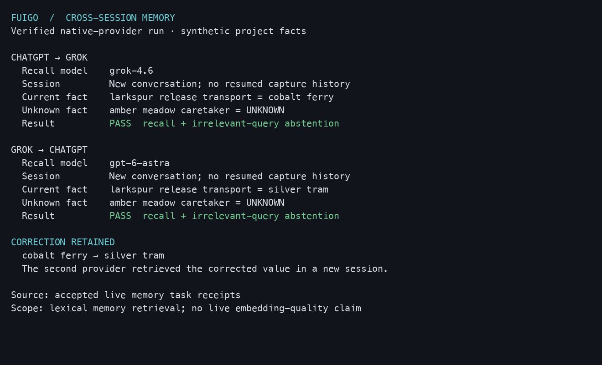

<div align="center">

# Fuigo

### An engine for AI that can act, collaborate, and remember.

[Get started](#get-started) · [Headless CLI](#headless-cli) · [ACP integration](#acp-integration) · [Memory](#memory-that-carries-forward) · [Documentation](#documentation) · [Build from source](#build-from-source)

</div>

Fuigo is a general-purpose AI agent engine. It gives models the machinery to work: tools, persistent sessions, permission controls, optional memory, and other agents to collaborate with. Use it to research and analyze information, create documents and code, produce structured outputs, or coordinate work across connected systems.

The Rust runtime handles execution, context, and collaboration. Its built-in tools work with files, search, and terminal commands; MCP servers and other configured tools extend what it can do in external services. Run it directly in a terminal, call it from a script, or put an application in front of it through ACP.

Choose your model and authentication route. Fuigo supports ChatGPT and Grok subscription access, Flux Router API keys, and configured compatible model endpoints. Switch models while keeping the conversation and tool history.



*A captured Fuigo session showing tool activity, passing tests, and a model switch.*

## One engine, three ways to work

| Surface | Use it for |
| --- | --- |
| **Interactive terminal** | Investigate a question, develop an idea, create and edit files, and review the agent's work in a full-screen TUI. |
| **Headless CLI** | Submit a task from a script or pipeline, stream events, return JSON, and resume saved sessions. |
| **ACP agent** | Connect an editor, application, or harness to sessions, streamed responses, tool updates, and permission requests over JSON-RPC. |

## What you can build with it

| Work | How Fuigo supports it |
| --- | --- |
| **Research and analysis** | Search available material, inspect source files, compare findings, and carry useful context through a session. Connected tools can supply additional sources. |
| **Creation** | Draft reports, write code, transform data, and produce files or structured responses. Specialized formats depend on the tools available in the workspace. |
| **Operations** | Run local commands and invoke connected services through configured tools, subject to the permissions you set. |
| **Collaborative workflows** | Delegate parts of a task to subagents, exchange follow-ups, and coordinate background or scheduled work. |
| **Agent-powered applications** | Use ACP to place your own interface or harness over the runtime's sessions, streaming, tools, and approval flow. |

## What the engine provides

- **Workspace tools:** file reading and editing, search, terminal execution, Git integration, and checkpoints.
- **Model selection:** named model configurations, per-model authentication, and supported reasoning-effort controls.
- **Delegation and workflows:** subagents, background tasks, follow-up messages, scheduled work, and workflow reminders that survive compaction.
- **MCP integration:** external tools, OAuth authentication, elicitation, and configured servers attached during workspace binding.
- **Persistent context:** resumable conversations, compaction, and optional cross-session memory with source provenance.
- **Extensibility and controls:** skills, plugins, hooks, project rules, tool permissions, and sandbox profiles.

## Get started

### Install

Requires Node.js 20 or newer. The npm launcher selects the binary for your platform.

```sh
npm install -g fuigo@latest
fuigo --version
```

Platform packages target macOS, Linux, and Windows on arm64 and x64. To update:

```sh
npm install -g fuigo@latest
```

### Connect a model

Fuigo reads user configuration from `~/.fuigo/config.toml`, or `$FUIGO_HOME/config.toml` when you set a separate home. Choose a subscription or API-key route below.

#### ChatGPT subscription

Sign in and list the model IDs available to your account:

```sh
fuigo login --provider chatgpt
fuigo models --provider chatgpt
```

Add this to your user config, replacing the model placeholder with an ID from the list:

```toml
[auth_provider.chatgpt-subscription]
subscription = "chatgpt"

[model.chatgpt-subscription]
model = "REPLACE_WITH_MODEL_ID_FROM_LIST"
base_url = "https://chatgpt.com/backend-api/codex"
auth_provider = "chatgpt-subscription"
```

Then open your project:

```sh
cd /path/to/project
fuigo -m chatgpt-subscription
```

Grok subscription login uses `fuigo login --provider xai`; list available models with `fuigo models --provider xai`. The [authentication guide](crates/codegen/fuigo-pager/docs/user-guide/02-authentication.md#chatgpt-and-grok-subscriptions) includes its named-model configuration, account selection, status, and logout commands.

Subscription credentials belong to Fuigo's own store; login does not import another application's session. Access depends on your account's entitlements. A subscription denial does not switch to a paid API key or Flux Router.

#### Flux Router API key

Set your Flux Router key in the shell, then define an explicit model route:

```sh
export FUIGO_API_KEY="YOUR_FLUX_ROUTER_API_KEY"
```

```toml
[model.flux]
model = "REPLACE_WITH_YOUR_FLUX_ROUTER_MODEL_ID"
base_url = "https://api.fluxrouter.ai/v1"
env_key = "FUIGO_API_KEY"
```

```sh
fuigo -m flux
```

Flux Router uses API keys. For other compatible endpoints, configure a separate named model with its own `base_url` and credentials. See [custom models](crates/codegen/fuigo-pager/docs/user-guide/11-custom-models.md).

## Headless CLI

Use the same configured model for a single task and return structured output:

```sh
fuigo -m chatgpt-subscription -p "Compare the proposals in this folder and summarize the tradeoffs" --output-format json --max-turns 4
```

JSON output includes the response and session ID. Continue that session in a later call:

```sh
fuigo -m chatgpt-subscription --resume SESSION_ID -p "Turn the findings into a concise recommendation" --output-format json
```

Use `--output-format streaming-json` for an event stream. For an unattended task that should execute tools without interactive approval, add `--yolo`; it enables automatic tool approval. Tool allowlists, deny rules, and sandbox settings let you bound the task. See [headless mode](crates/codegen/fuigo-pager/docs/user-guide/14-headless-mode.md).

## ACP integration

Run Fuigo as a local agent process for an ACP-capable client:

```sh
fuigo agent --model chatgpt-subscription stdio
```

The client exchanges JSON-RPC over stdin and stdout. It can create or load sessions, submit prompts, receive streamed replies and tool updates, and handle permission requests. Session configuration supports validated model and reasoning-effort selection.

For an unattended harness, use `fuigo agent --model chatgpt-subscription --always-approve stdio`. Fuigo also provides a WebSocket server transport. Start with the [agent integration guide](crates/codegen/fuigo-pager/docs/user-guide/15-agent-mode.md) and [`fuigo-acp-lib`](crates/codegen/fuigo-acp-lib) when building an integration; the Rust workspace is implementation source, not a separately versioned public SDK.

## Memory that carries forward

Memory is optional and **disabled by default**. Enable it in your user config:

```toml
[memory]
enabled = true
```



*A verification report from an actual memory exercise; this is a terminal report, not the memory browser.*

Use `/remember` to save a note, `/flush` to capture useful session knowledge, `/dream` to consolidate it, and `/memory` to browse stored material.

Memory combines workspace notes, session records, and a shared global `MEMORY.md`. Captured decisions and outcomes carry provenance and remain historical claims. Writes are serialized and atomic; consolidation retains raw sources and private recovery versions. Retrieval checks workspace boundaries and source freshness, excludes recognized secret and instruction-injection patterns, and removes stale injected context after source changes.

Lexical retrieval works without an embedding service. An explicitly configured embedding route adds semantic retrieval, with cache identity tied to its endpoint, model, and dimensions. Subscription login does not imply embedding access, and Fuigo does not silently substitute a paid embedding route.

See the [memory guide](crates/codegen/fuigo-pager/docs/user-guide/13-memory.md) for keyed corrections, retention, deletion, scoring, and the limits of automatic filtering.

## Documentation

The [user guide](crates/codegen/fuigo-pager/docs/user-guide/README.md) lives with the source and is available through `/docs` in the terminal.

| Topic | Guide |
| --- | --- |
| Setup and configuration | [Getting started](crates/codegen/fuigo-pager/docs/user-guide/01-getting-started.md) · [Configuration](crates/codegen/fuigo-pager/docs/user-guide/05-configuration.md) · [Authentication](crates/codegen/fuigo-pager/docs/user-guide/02-authentication.md) |
| External tools and extensions | [MCP](crates/codegen/fuigo-pager/docs/user-guide/07-mcp-servers.md) · [Skills](crates/codegen/fuigo-pager/docs/user-guide/08-skills.md) · [Plugins](crates/codegen/fuigo-pager/docs/user-guide/09-plugins.md) · [Hooks](crates/codegen/fuigo-pager/docs/user-guide/10-hooks.md) |
| Delegation and continuity | [Subagents](crates/codegen/fuigo-pager/docs/user-guide/16-subagents.md) · [Sessions](crates/codegen/fuigo-pager/docs/user-guide/17-sessions.md) · [Background tasks](crates/codegen/fuigo-pager/docs/user-guide/20-background-tasks.md) |
| Execution controls | [Permissions](crates/codegen/fuigo-pager/docs/user-guide/22-permissions-and-safety.md) · [Sandboxing](crates/codegen/fuigo-pager/docs/user-guide/18-sandbox.md) · [Project rules](crates/codegen/fuigo-pager/docs/user-guide/12-project-rules.md) |

## Inside the engine

Fuigo is a Rust workspace with separate surfaces, runtime, tools, and storage components.

| Source | Responsibility |
| --- | --- |
| [`fuigo-pager-bin`](crates/codegen/fuigo-pager-bin) | Composition root and executable |
| [`fuigo-pager`](crates/codegen/fuigo-pager) | Terminal interface, rendering, and interaction |
| [`fuigo-shell`](crates/codegen/fuigo-shell) | Agent/session runtime, authentication, and entry points |
| [`fuigo-sampler`](crates/codegen/fuigo-sampler) | Model requests and streamed responses |
| [`fuigo-tools`](crates/codegen/fuigo-tools) | Built-in tool implementations and delegation |
| [`fuigo-workspace`](crates/codegen/fuigo-workspace) | Filesystem, command execution, VCS, and checkpoints |
| [`fuigo-mcp`](crates/codegen/fuigo-mcp) | MCP transports, authentication, and tool integration |
| [`fuigo-memory`](crates/codegen/fuigo-memory) | Memory storage, indexing, retrieval, and consolidation |
| [`crates/common`](crates/common) | Shared protocols and runtime components |

## Bundle Fuigo with your application

The `fuigo` npm package provides the launcher and selects a matching versioned platform package: `@fuigo/darwin-arm64`, `@fuigo/darwin-x64`, `@fuigo/linux-arm64`, `@fuigo/linux-x64`, `@fuigo/win32-arm64`, or `@fuigo/win32-x64`.

For a controlled distribution, pin the Fuigo version and include the package for your target platform. Your application can launch the engine as an ACP process and own the user interface. Preserve the included license and attribution files when redistributing it. The [npm package sources](crates/codegen/fuigo-pager/npm/fuigo) show the launcher and packaging layout.

## Build from source

Install Rust through rustup; [`rust-toolchain.toml`](rust-toolchain.toml) pins the toolchain. Install [DotSlash](https://dotslash-cli.com) for the hermetic tools under [`bin/`](bin/). Protocol code generation uses `bin/protoc`, with a system `protoc` or `$PROTOC` as fallback. Native build prerequisites also include a C/C++ toolchain and CMake.

```sh
git clone https://github.com/FerroxLabs/fuigo.git
cd fuigo
cargo install dotslash
cargo build --locked -p fuigo-pager-bin --release
```

The binary is `target/release/fuigo-pager` (`fuigo-pager.exe` on Windows); the npm launcher exposes it as `fuigo`. Pass the same CLI arguments when running the source-built binary.

For development, target the affected crates:

```sh
cargo check --locked -p fuigo-pager-bin
cargo test --locked -p fuigo-memory --lib
cargo clippy --locked -p fuigo-memory
cargo fmt --all --check
```

The root [`Cargo.toml`](Cargo.toml) is generated. Follow repository instructions and prefer per-crate manifests for dependency changes. See [contribution policy](CONTRIBUTING.md) and [security reporting](SECURITY.md).

## License and lineage

Fuigo is independently maintained by Ferrox Labs under the [Apache License 2.0](LICENSE). It originated as a modified derivative of [Grok Build](https://github.com/xai-org/grok-build), with additional development and selectively integrated upstream changes. Fuigo is not affiliated with or endorsed by xAI or SpaceXAI.

See [NOTICE](NOTICE) for lineage and modification notices, [THIRD-PARTY-NOTICES](THIRD-PARTY-NOTICES) for dependency and source-port attribution, and [`third_party/NOTICE`](third_party/NOTICE) for vendored components. Third-party code retains its original licenses.
